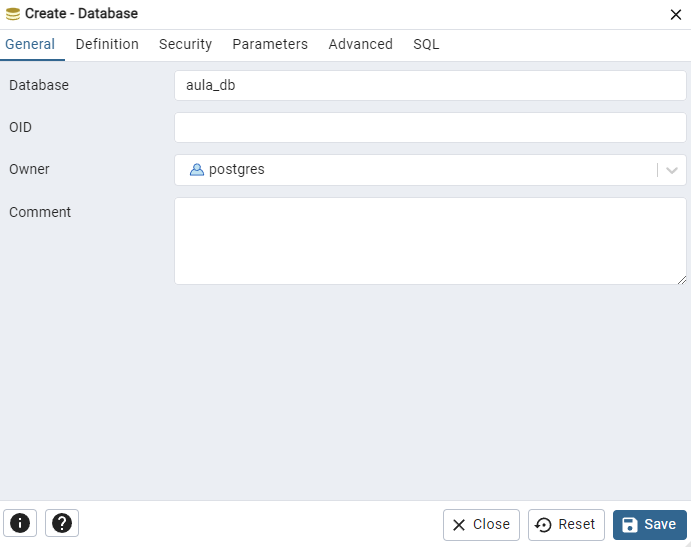
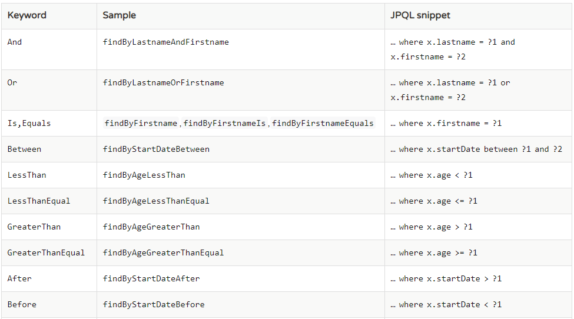

## **Trabalhando com SpringBoot e PostgreSQL** 📂📦

Foram desenvolvidos diversos projetos **SpringBoot** ao longo do aprendizado, neles foram apresentados os conceitos e usos de ``Component``, ``Beans``, ``Sigleton`` e ``Prototype`` (Scope), ``Value``, ``Configuration Properties``. Já no **Postgre** foi apresentado outros conhecimentos como a interface ``JpaRepository`` e seu uso para a adção de dados no postgree. Foi aprendido também o uso da ``@Query``e ``QueryMethods``, para manipulação e pesquisa dos dados inseridos nas tabelas.

Com bse nisso vou descrever todo meu aprendizado em relação a esse estudo.

> ***IMPORTANTE:*** ao final de cada tópico sera adicionado um link referenciando a pasta ao qual o código esta inserido, basta apenas executa-los.


### Component e Beans 🔗🫘

- ### Component

Esse foi o mais dificil de compreender, por conta de ser o primeiro e o essencial no Spring. Em resumo os ``Components`` servem para evitar a instanciação de objetos usando o ``new``. Isso ocorre pois, o próprio Spring gerencia os objetos injetando automaticamente em outras partes do código.

Com isso, os Objetos que necessitam ser instanciados é adicionado o ``@Autowired`` e na classe o ``@Component``. Isso facilita a manutenção e reduz o acoplamento do código.

``` java
@Component
public class SistemaDeMensagem {

    @Autowired
    Remetente comercial; // instanciado automaticamente

    [...]
}
```
<br>

- ### Beans

Beans tem basicamente a mesma utilidade que o Componenet é utilizado para evitar o uso do inicializador dos objetos com o `@Autowired` (new Object()), só que o beans é oara referenciar classes do Sistema, aqueles que não podem ser alterados por nós. Ex (`Gson()`, `Date()`, etc)

``` java
public class Beans {
    @Bean
    public Gson Gson() {
        return new Gson();
    }
}
```

Bean também pode ser utilizado como iniciador padrão, para classes e argumentos que ao inicializar ja possuiram determinados valores.

``` java
    @Bean
    public Remetente remetente() {
        System.out.println("CRIANDO OBJETO REMETENTE");

        Remetente remetente = new Remetente("comercial@Dio.com.br", "Comercial da DIO");

        return remetente;
    }
```

Caso não seja realizado o uso do `Scope("prototype")`, o Beans utilizará os dados não só como padrão, mas também aplicará o mesmo objeto a diversos objetos, ou seja, se existirem dois objetos criado com nomes diferentes, qualquer alteração realizada, será aplicada a ambos.

``` java
// Use como exemplo também o Bean criado acima Remetente()

// criado dois remetentes diferentes
@Autowired
Remetente comercial;

@Autowired
Remetente RH;

// na execução do programa, ambos recebem o valor padrão criado no Beans

System.out.println(comercial);
RH.setNome("Mensagem");
RH.setEmail("rh@dio.com.br");
System.out.println(RH);

// Mesmo alterando os dados apenas do 'RH',o valor será também atribuido ao 'comercial', pois ambos compartilham o MESMO OBJETO


```

> *Acesse a pasta clicando **[aqui](https://github.com/SilvaGustavoo/Trabalhando-com-Spring-Boot/tree/main/component-e-beans/primeiros-passos)*** 

<br>

### Value 🗝️📬


Value é geralmente utilizado para atribuir valores que estão escritos no documento de configuração do Spring o ``application.properties``. Com ela, podemos coletar os atributos e atribui-los diretamente na classe.

- no arquivo `application.properties`

``` properties
nome=SilvaGustavoo
email=gustavosantos728@yahoo.com.br
telefones=11658740425,11848485154,11956666666
```

essas informações são atribuidas inserindo a tag ``@Value`` como mostrado abaixo:

- no arquivo `SistemaMensagens.java`
``` java
@Value("${nome:No Found}")
private String nome;

@Value("${email}")
private String email;

@Value("${telefones}")
private List<Long> telefones;
```
> *Acesse a pasta clicando **[aqui](https://github.com/SilvaGustavoo/Trabalhando-com-Spring-Boot/tree/main/spring-propriety-value)***

<br>

## Configuration Properties ⚙️

O **Configuration Properties** tem praticamente a mesma função do ``@Value``, porém ele referencia os atributos do documento de configuração Spring utilizando prefixos. Ou seja, caso a chave desejada seja muito extenso, ele acaba deixando o código mais limpo.

- no arquivo `application.properties`

``` properties
remetente.nome=SilvaGustavoo
remetente.email=gustavosantos728@yahoo.com.br
remetente.telefones=11658740425,11848485154,11956666666
```

- no arquivo `SistemaMensagens.java`
``` java
@Configuration
@ConfigurationProperties(prefix = "remetente")
public class Remetente {

    private String nome;
    private String email;
    private List<Long> telefones;

    [...]
```

assim, todos os elementos recebem seus respectivos valores.

> *Acesse a pasta clicando **[aqui](https://github.com/SilvaGustavoo/Trabalhando-com-Spring-Boot/tree/main/usando-configuration-properties)***

<br>

## [JPA Repository](https://github.com/SilvaGustavoo/Trabalhando-com-Spring-Boot/tree/main/aula-spring-boot-data-jpa) 💾

O **JPA** tem como finalidade a comunicação do Java e o Banco de dados, fazendo com que seja salvo, coletado e alterado todos os seus dados pelos arquivos .java.

Para que isso ocorra é necessário uma serie de passos e configurações relevantes no seu código. Sendo dividas em configuração do banco de dados, criação de @chaves obrigatórias e adição de depedências.

### Configuração do Banco de Dados

primeiro é necessário escolher seu software de Banco de dados, no caso eu utilizei o PostgreSQL. Abra o seu banco de dados e crie um novo Data Base e escolha seu nome.

> **OBS:** caso for utilizar usar um diferente verifique sua implementação




Após criar o banco de dados, abra ou crie o seu código spring e adicionando dependencias ``Spring Data JPA`` e o ``PostgreSQL Driver`` *(selecione o banco de dados que você escolheu)*. Por fim, adicione o código no documento de configuração do Spring o `application.properties`.

``` properties
#Opcional
spring.jpa.show-sql=true

# Cria e atualiza as tabelas, caso não estejam criadas
spring.jpa.hibernate.ddl-auto=update 


#Obrigátorio de acordo com o seu banco de dados
spring.jpa.database-platform=org.hibernate.dialect.PostgreSQLDialect
spring.datasource.driverClassName=org.postgresql.Driver
spring.datasource.url=jdbc:postgresql://localhost:5432/[SUA_DATABASE]
spring.datasource.username=postgres
spring.datasource.password=[SUASENHA]

```

Depois disso basta criar suas tabelas usando as suas classes, e inserindo  o ``@Entity``e definindo o ``@Id`` para que o JPA reconheça no sistema. 

- Para o ``@Id``, é possivel configurar uma geração automatica de valores, de acordo com a regra de negócio, utilizando o ``@GeneratedValue`` junto com a ``@GeneratedType.[Sua escolha]``. 

- Na configurção das colunas é utilizado o ``@Column``, e dentro dele implementado as configurações desejadas, como o ``nullabel``, ``name``, entre outras.

``` java
@Entity
public class Aluno {
    @Id
    @GeneratedValue(strategy = GenerationType.IDENTITY)
    @Column(name = "ra_aluno")
    private Integer ra;

    @Column(name = "nome_aluno", nullable = false)
    private String nome;

    [...]
}
```

Agora para a integração do seu código com o banco de dados é necessário a criação de uma interface personalziada, aqui foi chamada de ``AlunoRepository``, a qual herda o `JpaRepository`. Com ele agora é possível salvar, alterar e buscar ``Alunos``, usando os respectivos metodos, ``save()`` e ``findBy..()``.

``` java

// criação do repositorio, pode deixar vazio se quiser
public interface AlunoRepository extends JpaRepository<Aluno, Integer>{ }

@Autowired
AlunoRepository repository;

// dentro do código executavel

repository.save(aluno);
repository.findByName(String name);
```

Para as buscas é possível criar diretamente na interface, usando alguns metodos, sendo ele o ``@Query`` e o ``QueryMethodo``. 

- o ``@Query`` pode ser usado para inserir códigos SQL diretamente. O formato de escrita obriga a utilização de uma variavel para receber os dados, que abaixo foi utilizado o 'u' apartir disso é desenvolvido de acordo com a sua necessidade. Se for preciso inserir uma variavel, basta defini-la após ':' e adiciona-la dentro do ``@Param``


``` java
// procurar com query
@Query("SELECT u FROM Aluno u WHERE u.classe LIKE %:texto%")
List<Aluno> contemNaClasse(@Param("texto") String texto);
```

- ja o ``QueryMethodo`` o proprio sistema do JPA oferece opções de buscas ja inseridas, como na função abaixo, que ao inserir palavras chaves como "find"(encontre), "Containing"(contendo), etc. ele ja faz a busca com base nisso. que no caso, foi a busca da classe do aluno que conti um determinado texto

``` java
// procurar contendo x valor
public List<Aluno> findByClasseContaining(String classe); 
```

Para consuultar possiveis usos do QueryMethodo é só utilizar a tabela abaixo, onde mostra todas as palavras reservadas



<br>

## API Rest 

Aqui foi implementado tudo que foi aprendido, foi desenvolvido um banco de dados PostgreSQL com uma tabela da classe ``Usuario`` e apartir dela criado um ``UsuarioRepository`` que por fim recebeu o UsuarioController que fizeram as requisições HTTP. Ainda foi adicionado um tratamento de exeções personalizadas e integrado com o ``Swagger``. A organização do código ficou da seguinte maneira

- Package controller
    - UsuarioController
- Package doc
    - SwaggerConfig
- Package Handler
    - ResponseError
    - GlobalExceprionHandler
    - BusinessException
- Package model
    - Usuario
- Package Repository
    - UsuarioRepository

- ## Requisições HTTP

As requisições HTTP usadas no código foram **GET, POST, DELETE e PUT**. Elas que fizera a interação entre o código, banco de dados e o servidor. Para implementa-lo é necessário a instalção da dependência ``Spring Web``.

Para definir um documento para requisição HTTP, é necessário inserir o ``@RestController`` para que o sistema reconheça e execute as funções de requisição. Ao iniciar qualquer função de requisição é ideai definir o tipo de requisição com o ``@[Ger, Delete, Post...]Mapping`` e tambem inserir um prefixo dentro deles definindo a localização do retorno da função que no caso foi retornado no 

``` java
// Pesquise no navegador após executar o Spring
// localhost:8080/usuarios -> mostra todos os usuarios cadastrados
@GetMapping("/usuarios")
public List<Usuario> getUsers() { ... }
```
**Somente o Get pode ser visto no localhost** os outros precisam de uma requisição, mas antes precisam ser criados. Para a criação de uma requisição que necessita de uma variavel simples pode ser usado o ``@PathVariable(variavel)`` e informando a variavel dentro da URL usando "{}". Já para objeto como um Usuario que possui diversos atributos, pode ser usado o @RequestBody. Ele pode receber os valores digitados no Body dos softwares de requisição.

``` java
@GetMapping("/contendo={palavra}")
public List<Usuario> findByLogin(@PathVariable("palavra") String palavra) {...}

@PostMapping("")
public void postUser(@RequestBody Usuario usuario) {
    repository.save(usuario);
}
```

> **OBS:** Para requisições importantes como o POST (Adicionar item), DELETE e PUT (atualizar item) é necessário uma requisição no sistema, pode ser utilizada o Postman ou o Swagger.

- ## Swagger API

O Swagger facilita a visualização das APIs e tambem a sua documentação, com ela podemos fazer requisições simples e específicas com o uso do Body, para criar um Swagger foi configurado todas as informações minhas e das minhas APIs

``` java
// Dados para entrar em contato
public Contact contato() {...}

// Informações basicas da API, titulo, descrição, versão, entre outros.
public Info iformacoesApi() [...]

// Cria o nosso Swagger
@Bean
public OpenAPI customOpenAPI() {
    return new OpenAPI()
            .info(informacoesApi())
            .externalDocs(new ExternalDocumentation()
                    .description("Documentação Completa")
                    .url("https://github.com/silvagustavoo"));
}
```

Para a implementação do Swagger foi necessário buscar por fora as dependencias a serem utilizadas, e utilizada a versão compatível com o meu Spring Boot 3.X e Springdoc API, as depedências utilizadas foram 

``` xml
<!-- Dependência correta para Spring Boot 3.x -->
<dependency>
    <groupId>org.springdoc</groupId>
    <artifactId>springdoc-openapi-starter-webmvc-ui</artifactId>
    <version>2.2.0</version>
</dependency>
```

- ## Handler - Exceções Personalizadas

O handler foi utilizzado para demonstrar os erros de maneira personalizada, ficando mais simples de entender o problema ocorrido. Para a funcionalidade do tratamebto foi feita, a criação da exceção ``BusinessException``, a da Respota pelo ``ResponseError`` e aquele que Irá gerenciar tudo o ``GlobalExceptionHandler``


 Para definir onde se encontrará o gerenciador da(s) Excptions, é necessário inserir o ``@RestControllerAdvice`` na classe desejada. Por ela será possivel o tratamento das Exception e personalização da API Response.


 Dessa maneira, deve se definir a classe a qual você quer retornar uma mensagem. A maneira que você desenvolver a classe será o retorno do erro em JSON assim como um toString(), no meu caso será 
 ``` json
{
    "timestamp" : "{DATA E HORA ATUAL}",
    "status" : "error",
    "statusCode" : "{CÓDIGO ESPECIFICO}",
    "error" : "{MENSAGEM DE ERRO DEFINIDA}"
}
 ```

Após definido crie a sua função de erro na classe de Exceptions @RestControllerAdvice nela deve conter como retorno a sua classe de Resposta de erro (no meu caso ResponseError) e definir suas variaveis.

Para que seja demonstrado o numero do erro HTTP, basta utilizar o ``@ResponseStatus`` e definir o HttpStatus de acordo com o problema. Mas para que o retorno do ResponseError seja em JSON é necessário atribuir o ``@ResponseBody``. E por fim é necessário informar a classe do erro quando executado, que no nosso caso foi o `BusinessException`.

``` java
@ResponseStatus(HttpStatus.PRECONDITION_REQUIRED)
@ResponseBody
@ExceptionHandler(BusinessException.class)
public ResponseError handler(BusinessException ex) {
    // Cria uma mensagem de erro personalizada mostrando os valores da class ResponseError e personalizando o código do erro e a mensagem
    return new ResponseError(HttpStatus.PRECONDITION_REQUIRED.value(), ex.getMessage());
}


// Para chamar a Exception basta usar 
throw new BusinessException("mensagem");
```
<br>

Assim para quando chamado o erro, seja retornado:

``` json
{
    "statusCode": 428,
    "error": "O campo nome ou senha são obrigatórios",
    "timestamp": "2025-02-04T22:38:52.831+00:00",
    "status": "error"
}
```